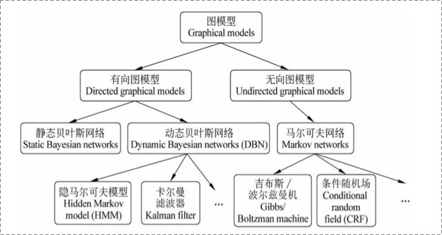
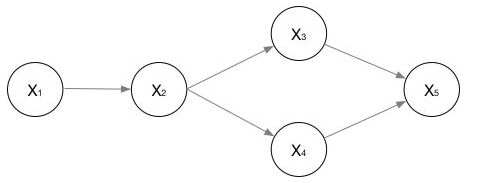
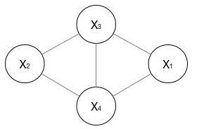
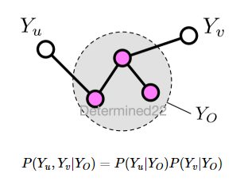
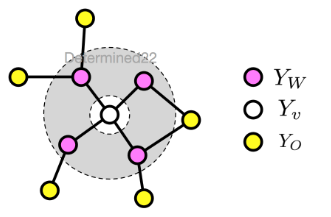
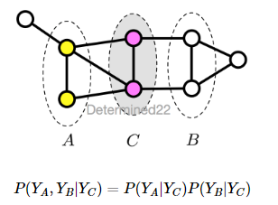
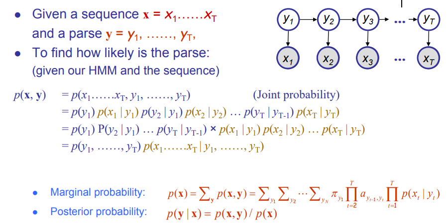

# PGM HMM MEMM CRF

@author mxy

@date 2018/9/28

为了对CRF有一个全面的了解，以一种追根溯源的方式，从概率无向图（PGM），到隐马尔科夫（HMM），到最大熵模型（MEMM），再到条件随机场（CRF）做
一个粗略的介绍。

## Why PGM

从传统机器学习是否对观察到的样本进行概率建模的角度来看，可分为非概率模型和概率模型。非概率模型指的是直接学习输入空间到输出空间的映射，学习的过程
不涉及概率密度的估计，概率密度的积分等操作，问题的关键在于最优化问题的求解，即如何在输入和输出空间之间找出最优的映射函数出来。通常为了学习h(x),我们
会首先根据先验知识(prior knowledge)选择一个特定的假设空间H(函数空间)，比如所有线性函数构成的假设空间,然后在这个空间找出使得泛化误差最小的假设出来。
$$ h^{\*} = argmin_{h\subset{H}} \Xi(h) = argmin_{h\subset{H}} \sum{l(h(x),y)P(x,y)} $$
其中$ l(h(x),y) $ 是我们选取的损失函数，选择不同，则泛化误差结果不同。由于我们并不知道$ P(x,y) $ ,所以即使选好了损失函数，也无法计算出假设的
泛化误差，更别提找出argmin来了。于是，转去寻找使得 经验误差最小 的假设,
$$ g =  argmin_{h\subset{H}} \frac{1}{m} \sum{l(h(x^{(i)}),y^{(i))} $$
这种学习策略叫经验误差最小化(ERM),理论依据是大数定律：当训练样例无穷多的时候，假设的经验误差在概率意义下无限接近假设的泛化误差。

而概率模型则是将学习任务归结于计算变量的概率分布。利用已知变量推测未知变量的分布称为“推断”(inference)，其核心是如何基于可观测变量推测出未知变量
的分布。概率模型指出了学习的目的是学出P(x,y)或者P(x|y),对于P(x,y)的估计，一般是根据乘法公式P(x,y) = P(x|y)P(y)将其拆解成P(x|y),P(y)分
别进行估计。无论是对P(x|y),P(y)还是P(y|x)的估计，都是会先假设分布的形式，例如逻辑斯特回归就假设了Y|X服从伯努利分布。分布形式固定以后，剩下
的就是分布参数的估计问题。常用的估计有极大似然估计(MLE)和极大后验概率估计(MAP)等。

具体来说，假定模型所关心的变量集合为Y（Y一般指机器学习模型所需数据的label），可观测变量集合为O（O一般指模型的输入X），其他变量为R（R一般指整个数据集中
，模型中的隐变量，如拿球试验中的袋子），生成式模型考虑联合分布P(Y,R,O),判别式考虑条件分布P(Y,R|O).推断就是要由P(Y,R,O)或P(Y,R|O)得到条件概率分布
P(Y|O). 直接利用概率求和规则消去R显然不可行，因为即便每个变量是二取值，复杂度已至少是$ O(2^{|Y|+|R|}) $, 另一方面，属性之间往往存在复杂的联系
，上一个变量的属性对当前变量的属性值有一定的影响，例如词性标注中的词性；最后如果存在不可观测变量，如何通过已有证据计算它们的条件概率分布也是困难的。
所以为了研究高效的推断和学习算法，需要有一套能简洁紧凑表达变量间关系的工具。

（CMU）概率图模型的三个优势：

1.结合领域知识和因果（逻辑）结构。

2.数据融合。

3.贝叶斯哲学，从数据中学习知识

## PGM Introduction

概率图模型是一类用图来表达变量间相关关系的概率模型，G=(V,E),V表示节点，即随机变量，E表示边，即变量间的概率相关关系。根据边的性质不同，可分为
有向无环图和无向图模型。有向图中最经典的是隐马尔科夫模型。

### 有向图模型
对于有向图模型，联合概率可表示为：$$ P(x_{1},...,x_{n}) = \prod_{i=0} {P(x_{i}|\pi{x_{i}})} $$

举例： 

联合概率表示为：
$$ P(x_{1},...,x_{n}) = P(x_{1})P(x_{2}|x_{1})P(x_{3}|x_{2})P(x_{4}|x_{2})P(x_{5}|x_{3},x_{4}) $$

### 无向图模型
无向图模型也称为马尔科夫随机场。不同于有向图模型，无向图模型的无向性很难确保每个节点在给定它的邻节点的条件下的条件概率和以图中其他节点为条件的
条件概率一致。由于这个原因，无向图模型的联合概率并不是用条件概率参数化表示的，而是定义为由一组条件独立的局部函数的乘积形式，此函数也称为**势函数**。
亦称“因子”(factor)，这是定义在变量子集上的非负实函数，主要用于定义概率分布函数。常用方法为**因子分解**(Factorization),因子分解就是说将
无向图所描述的联合概率分布表达为若干个子联合概率的乘积，从而便于模型的学习和计算。

上图显示出一个简单的马尔科夫随机场，对于图中节点的一个子集，若其中任意两节点间都有边连接，则称该节点子集为一个“团”(clique)，若在团中加入另外任何一个
几点都不在形成团，则称该团为极大团(maximal clique).如上图中{x1,x3},{x1,x4},{x3,x4},{x2,x3},{x2,x4},{x1,x3,x4},{x2,x3,x4}都是团，其中
{x1,x3,x4},{x2,x3,x4}是极大团，显然每个节点都至少出现在一个极大团中，每个团中都有边相连。

在马尔科夫随机场中，多个变量之间的联合概率分布能基于团分解为多个因子的乘积，每个因子仅与一个团有关。具体来说，对于n个变量，$ x=(x_{1},...,x_{n}) $,
所有团构成的集合为C，与极大团$ Q\inC $ 对应的变量集合记为$ x_{Q} $ ,则联合概率P(x)定义为：
$$ P(x)=\frac{1}{Z} \prod_{Q\inC}\psi_{Q}(x_{Q}) $$ 

其中$ \psi_{Q} $为与团Q对应的势函数，用于对团Q中的变量关系进行建模，$Z=\sum_{x}\prod_{Q\inC}\psi_{Q}(x_{Q})$ 为规范化因子，以确保P(x)
被正确定义的概率。所以像上面的图的中，$ x=(x_{1},...,x_{4}) $,联合概率分布P(x)定义为：
$$ P(x)=\frac{1}{Z}\psi_{1}(x_{1},x_{3},x_{4})\psi_{2}(x_{2},x_{3},x_{4}) $$ 

由于要求势函数严格为正，通常将其定义为指数函数：
$$ \psi_{C}(x)=exp(-E[x]) $$

上面的因子分解过程就是Hammersley-Clifford 定理。

在马尔科夫随机场中如何得到“条件独立性”呢，或者说如何保证概率图是否无概率无向图呢。

如果一个概率图的联合概率分布满足成对、局部或者全局马尔科夫性，就称此联合概率分布为概率无向图模型或马尔科夫随机场。

1.成对马尔科夫性(pairwise Markov property)

设无向图 G 中的任意两个没有边连接的节点 u 、v ，其他所有节点为 O ，成对马尔可夫性指：给定 $ Y_{o} $ 的条件下，$ Y_{u} $ 和 $ Y_{v} $ 条件独立.

2.局部马尔科夫性(local Markov property)

设无向图 G 的任一节点 v ，W 是与 v 有边相连的所有节点，O 是 v 、W 外的其他所有节点，局部马尔可夫性指：给定 $ Y_{w} $ 的条件下，$ Y_{v} $ 和 $ Y_{o} $ 条件独立.

3.全局马尔科夫性(global Markov property)

设节点集合 A 、B 是在无向图 G 中被节点集合 C 分开的任意节点集合，全局马尔可夫性指：给定 $ Y_{C} $ 的条件下，$ Y_{A} $ 和 $ Y_{B} $ 条件独立.

## HMM

不懂的先看这个：[入门级](https://www.zhihu.com/question/20962240)

隐马尔可夫模型（Hidden Markov model，HMM）属于生成式模型，被广泛用于序列标注问题，在语音语言领域里比较出名的应用包括语音识别、中文分词（CWS）、词性标注（POS）等。
隐马尔可夫模型是关于时序的概率模型，描述由一个隐藏的马尔可夫链随机生成不可观测的状态随机序列，再由各个状态生成一个观测而产生观测随机序列的过程。
隐藏的马尔可夫链随机生成的状态序列，称为状态序列（state sequence),每一个称为状态变量${x_{1},x_{2},...,x_{n}} $，通常假定状态变量是隐藏的、不可被观测的，因此状态变量
也称为“隐变量”;每个状态变量生成一个观测变量${o_{1},o_{2},...,o_{n}}$，而由此产生的观测的随机序列，称为观测序列（observation sequence)。观测变量的取值仅依赖于状态变量，
即$x_{i}$由$o_{i}$确定，与其他状态变量和观测变量无关；同时，i时刻的状态$o_{i}$仅依赖前一时刻的状态，与其他状态无关，这就是所谓的“马尔可夫链”：
系统下一时刻的状态仅有当前状态决定，不依赖于以往任何状态。基于这种依赖关系，所有变量的联合概率分布为：

上图中的y就是观测变量o。除了观测变量X和隐变量O，HMM 还需要确定状态转移概率A、输出观测概率B、初始状态概率$\pi$。HMM模型需要学习这五组参数(X,O,A,B,$\pi$).

举例来说：应用到词性标注中，x代表词语，是可以观察到的。o代表我们要预测的词性（一个词可能对应多个词性）是隐含状态。应用到分词中，x代表词语，
是可以观察的。o代表我们的标签（B,E这些标签，代表一个词语的开始，或者中间等等）。应用到命名实体识别中，x代表词语，是可以观察的。o代表我们的标
签（标签代表着地点词，时间词这些）.其他的A,B,$\pi$，这些概率分布信息（上帝信息）是需要学习过程中确定的。

HMM的三个基本问题：概率计算、解码和学习问题：

1. 概率计算问题。给定HMM模型λ（A,B,$\pi$）和观测序列o,如何计算给定模型下观测序列o出现的概率 P(O|λ)？前向、后向算法
2. 解码问题。给定一个HMM λ 和一个观测序列 O ，如何最大化 P(Q|O)，求出“最有可能”的状态序列 Q ？维特比算法
3. 学习问题（learning）。给定若干观测序列 O（对应的状态序列 Q 可能已知也可能未知），如何训练出模型参数 λ ，使得 P(O|λ) 最大化？——EM算法

待补充。。。

NLP中的序列标注问题对应于解码问题，首先学习完一个HMM模型之后，通过观测序列找出隐含状态序列，条件是这个隐状态序列概率是最大的那一个。

## Reference

1.机器学习第十四章。周志华著

2.[Probabilistic Graphical Models](http://www.cs.cmu.edu/~epxing/Class/10708-14/lecture.html)

3.[如何用简单易懂的例子解释crf](https://www.zhihu.com/question/35866596)

4.[NLP图模型](https://www.cnblogs.com/Determined22/p/6915730.html)

5.[一步一步理解最大熵](https://www.cnblogs.com/wxquare/p/5858008.html)

6.[crf-tutorial](https://people.cs.umass.edu/~mccallum/papers/crf-tutorial.pdf)

6.[监督学习的分类](https://zhuanlan.zhihu.com/p/26012348)

7.[隐马尔科夫](https://zhuanlan.zhihu.com/p/26811689)
