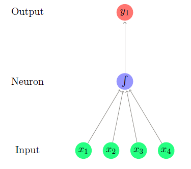
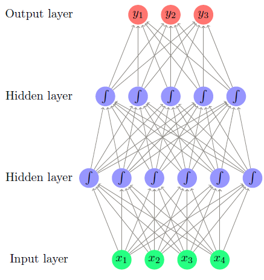
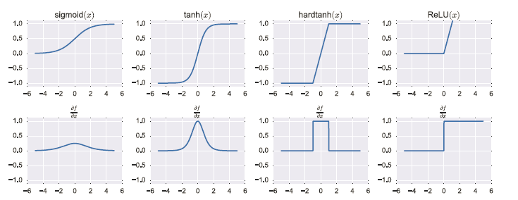

# Feed Forward Neural Networks

date@2018/9/16

author@mxy

## A BRAIN-INSPIRED METAPHOR

Neural-networks were inspired by the brain’s computation mechanism, which consists of computation units called neurons.

a neuron is a computational unit that has **scalar** inputs and outputs. Each input has an associated weight. The neuron 
multiplies each input by its weight, and then sums1 them, applies a non-linear function to the result, and passes it to
its output.Below figure shows such a neuron: 

In one layer, the neurons doesn't connect to each other, but in different layers with weights.If the weights are set 
correctly, a neural network with enough neurons and a non-linear activation function can approximate a very wide range 
of mathematical functions.

A typical feed-forward neural network often looks like this:

So we can see, the feed forward neural network is simply a stack of linear models separated by non-linear functions.

## IN MATHEMATICAL NOTATION

In mathematical view, the one hidden layer neural network  has the form:
$$ NN(x) = g(x(W_{1})+b_{1})W_{2}+b_{2} $$

Taking the view in chapter 3, the first layer transforms the data into a good representation, while the second layer 
applies a linear classifier to that representation.

The output of the neural network is a $ d_{out} $ dimensional vector. The dimension of the output decide the tasks 
that neural network suits. 

Unlike linear models, the loss function of multi-layer neural networks with respect to their parameters is not convex,
making search for the optimal parameter values intractable.

## REPRESENTATION POWER

MLP1 can approximate with any desired non-zero amount of error a family of functions6 that include all continuous 
functions on a closed and bounded subset of Rn, and any function mapping from any finite dimensional discrete 
space to another.

## COMMON NON-LINEARITIES

The non-linearity g can take many forms. There is currently no good theory as to which non-linearity to apply in which 
conditions, and choosing the correct non-linearity for a given task is for the most part an empirical question.

**sigmoid:** $f(x) = 1/(1+e^{-x})$

**tanh:** $tanh(x) = e^{2x-1}/e^{2x+1}$

**RELU:** $ReLU(x) = max(0,x) = 0, if x<0; otherwise = x$

**hard tanh:** $hardtanh(x) = -1, if x<-1; = 1, if x>1; =x, otherwise$

Figure shows the shapes of the di↵erent activations functions, together with the shapes of their derivatives.

## LOSS FUNCTIONS

Loss function L(ˆy, y):stating the loss of predicting ˆy when the true output is y.

## REGULARIZATION AND DROPOUT

The regularizers L1, L2 and the elastic-net are also important for neural networks.In particular, L2 regularization,
also called weight decay is e↵ective for achieving good generalization performance in many cases, and tuning the 
regularization strength is advisable.

Another effective technique for preventing neural networks from overfitting the training data is dropout training[Hinton 
et al., 2012, Srivastava et al., 2014].It works by randomly dropping (setting to 0) half of the neurons in the network 
(or in a specific layer) in each training example in the stochastic-gradient training.

## EMBEDDING LAYERS

Embedding is transforming the input data into a different(always low) dimensional vector which pass it to the next layer.

The parameters in embedding layers can learn with the classifier simultaneously.