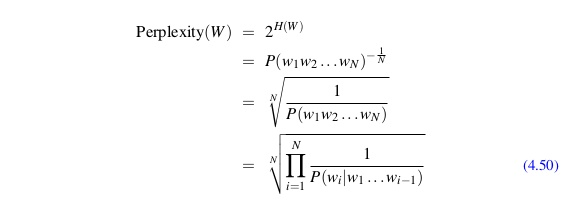

# Perplexity(困惑度)

@author mxy

@date 2018/9/6

## Introduction

所谓语言模型（Language Model，LM），即给定一句话的前k个词，我们希望语言模型可以预测第k+1个词是什么，即给出一个第k+1个词可能出现的概率的
分布。困惑度是衡量模型好坏的一种指标，perplexity中文译为困惑度，其数学形式是交叉熵的指数形式：

在nlp中通常展开形式如下：

直观的解释是：如果我们在每一个timestep从语言模型的输出（概率分布）中随机挑选单词，平均挑选几个单词能得到最后的正确输出。显然困惑度越小说明
语言模型越好。

## Reference

1.[求通俗解释NLP里的perplexity是什么？](https://www.zhihu.com/question/58482430)

2.[如何评价语言模型的好坏——困惑度、混淆度](http://sentiment-mining.blogspot.com/2016/11/perplexity.html)

3.[Graham Neubig: Neural Machine Translation and Sequence-to-sequence Models: A Tutorial](https://arxiv.org/abs/1703.01619)
