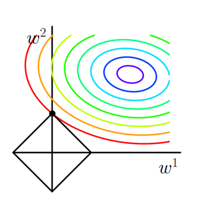
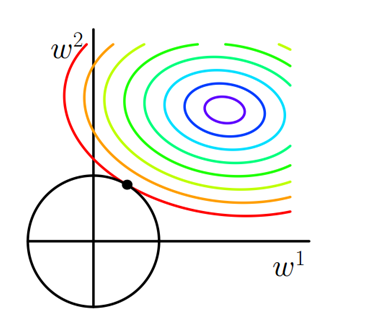
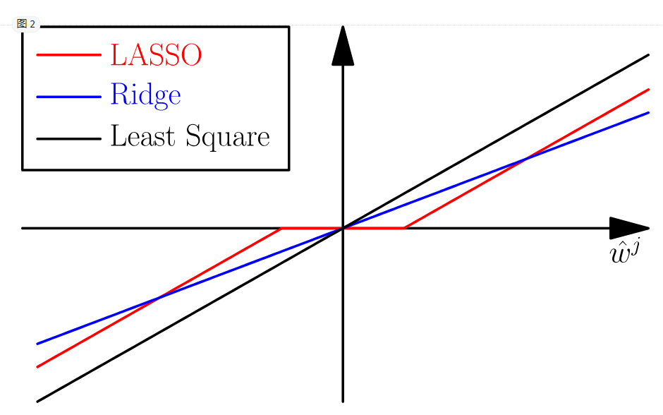

# Regularization

@date 2018/9/7

@author hcy

*Regularization* is a technique used in an attempt to solve the ***overfittting*** problem in statistical model.

## The problem of overfitting

If we have too many features, the learned hypothesis may fit the training set very well (J(θ)=0), but fail to generalize to new examples(Predictions on new examples). i.e.  it sticks too much to the data and the model has probably **learned the background noise** while being fit. This isn't of course acceptable.

什么情况下会出现？这样的问题通常称为“small n , large p problem”——我们一般用 n表示数据点的个数，用  p表示变量的个数，即数据维度。当$p\geq n$的时候，不做任何其他假设或者限制的话，学习问题基本上是没法进行的。因为如果用上所有变量的话， p越大，通常会导致模型越复杂，但是反过来n又很小，于是就会出现很严重的 overfitting 问题。

## How to solve it

- choose fewer feature
- **regularization technique**

You penalize your loss function by adding a multiple of  *L1* (LASSO) or an *L2* (Ridge) norm of your weights vector $\omega$, you get the following equation:
$$
L(X,Y) + \lambda N(\omega)
$$

- L1 (LASSO)

$$
l1: \Omega(\omega)= ||\omega||_1 = \sum_i|\omega_i|
$$

- L2(Ridge)

$$
l2: \Omega(\omega)= ||\omega||_2^2 = \sum_i\omega_i^2
$$

## 理解 L1, L2

为了解决过拟合，我们需要限制模型的复杂度，很自然的思路是减少系数$\omega$的个数。近似来说，就是要求某些权重$\omega$接近于0。即：
$$
min_{\omega}J(\omega ;X, y) \\
s.t. ||\omega||_1 \leq C  \\
或 ||\omega||_2\leq C
$$

利用拉格朗日函数，和下式等价：

$$
min_{\omega}J(\omega;X,y)+\alpha||\omega||_1 \\
或 min_{\omega}J(\omega;X,y)+\alpha||\omega||_2^2
$$

更直观的理解看图：

- $l1$

  

  因为L函数有很多『突出的角』（二维情况下四个，多维情况下更多），J与这些角接触的机率会远大于与L其它部位接触的机率，而在这些角上，会有很多权值等于0，这就是为什么L1正则化可以产生稀疏模型，进而可以用于特征选择.

- $l2$

  

  二维平面下L2正则化的函数图形是个圆，与方形相比，被磨去了棱角。因此J与L相交时使得$\omega_1$或$\omega_2$等于零的机率小了许多，这就是为什么L2正则化不具有稀疏性的原因。

- 对比

  

$l1$ 正则化则会使原最优解的元素产生不同量的偏移，并使某些元素为0，更多是的产生稀疏性；另外也可看作是$l_0$范式的一个最优凸似解，容易优化求解。$l2$正则化的效果是做了一个全局缩放，更多的是防止过拟合，提高模型的泛化能力； 

## How to choose the regularization term $\lambda$

 One possible answer is to use ***cross-validation***

## 相关引用

> Sparsity and Some Basics of L1 Regularization

http://freemind.pluskid.org/machine-learning/sparsity-and-some-basics-of-l1-regularization/

>  机器学习中正则化项L1和L2的直观理解

https://blog.csdn.net/jinping_shi/article/details/52433975

