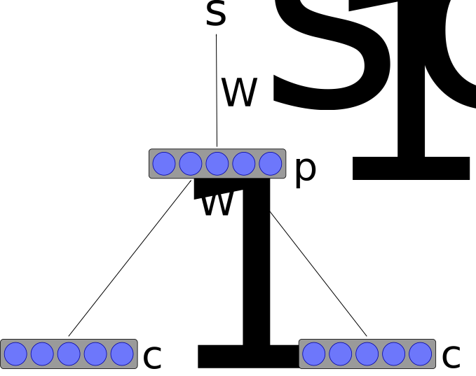

# 循环神经网络(Recurrent neural network) vs 递归神经网络(Recursive neural network)
@author mxy

@date 2018/9/5

一直以来我们平常所使用的RNN，包括LSTM、GRU等变种，基本上都是循环神经网络(Recurrent neural network)。其实循环神经网络和递归神经网络(Recursive neural network)是有区别的，准确来说：
递归神经网络是循环神经网络的更一般的结构或者说循环神经网络是递归神经网络的特例（chain rule）。

## 循环神经网络

上图是循环神经网络按时间序列展开后的图，它一般处理的是输入是序列，输出也是序列。信息可以从前边传递到后边，像是一条链上，
从左到右的传递。在神经网络结构上表现为后面的神经网络的隐藏层的输入是前面的神经网络的隐藏层的输出.详细的介绍请转【引用1】

## 递归神经网络

上图是最简单的递归神经网络结构图。子节点通过权重矩阵和非线性激活函数连接到父节点上，和循环神经网络相比，这里的权重矩阵是全局共享，而前者只在
一个sequence上共享。如果$c_{1}$和$c_{2}$是n维向量，他们的父节点也应该是n维向量：

$$ p_{1,2} = tanh(W[c_{1};c_{2}]+b) $$

其中W是需要学习的 $nx2n$的权重矩阵。把产生的父节点的向量和其他子节点的向量再次作为网络的输入，再次产生它们的父节点。如此递归下去，直至整棵
树处理完毕。最终，我们将得到根节点的向量，我们可以认为它是对整棵树的表示，这样我们就实现了把树映射为一个向量。如下图所示是更一般的递归神经网
络结构图。

其中x是输入，y是输出。$ x_3, x_4, x_5 $首先计算得到值，再与$x_2$计算得到根节点的值。相比于循环神经网络，递归神经网络一般可以从空间维度上展开，展开后是一个树的结构。在nlp中，
对句子进行建模的话，假设句子是一个树结构，由主语、谓语和宾语等组成，而每个部分又可以分成几个小部分，即某一部分的信息由它的子树的信息组合而来，
整句话的信息由组成这句话的几个部分组合而来。

递归神经网络的训练算法和循环神经网络类似，两者不同之处在于，前者需要将残差从根节点反向传播到各个子节点，而后者是将残差从当前时刻反向传播到初始时刻。

递归神经网络因为无法处理随着递归，权重指数级爆炸或消失的问题（Vanishing gradient problem）。

## Reference

1.[Recurrent Neural Networks Tutorial, Part 1 – Introduction to RNNs](http://www.wildml.com/2015/09/recurrent-neural-networks-tutorial-part-1-introduction-to-rnns/)

2.[Understanding LSTM Networks](http://colah.github.io/posts/2015-08-Understanding-LSTMs/)

3.[零基础入门深度学习(7) - 递归神经网络](https://zybuluo.com/hanbingtao/note/626300)

4.[Recursive Deep Models for Semantic Compositionality Over a Sentiment Treebank](https://nlp.stanford.edu/~socherr/EMNLP2013_RNTN.pdf)

